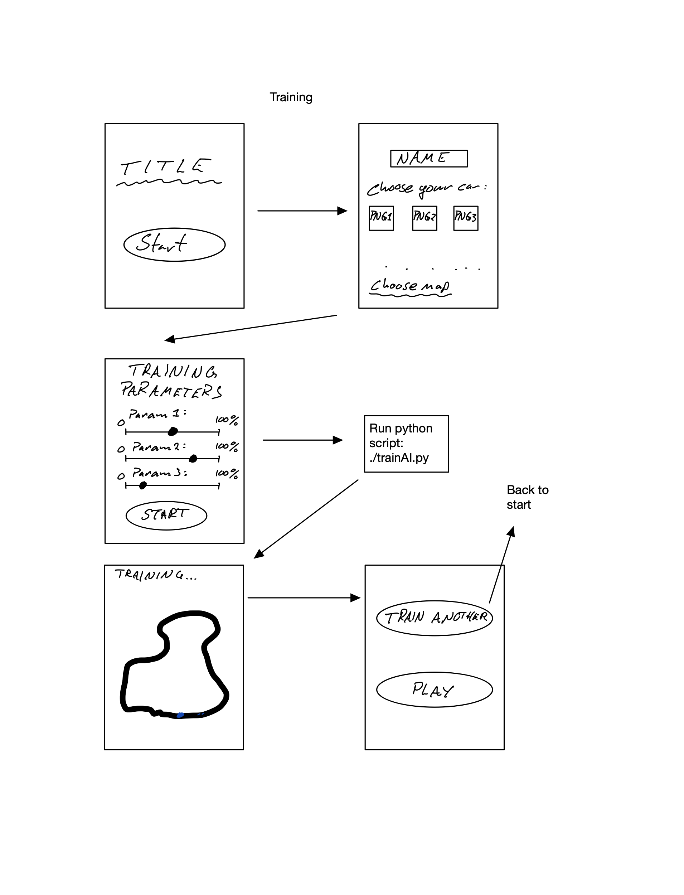
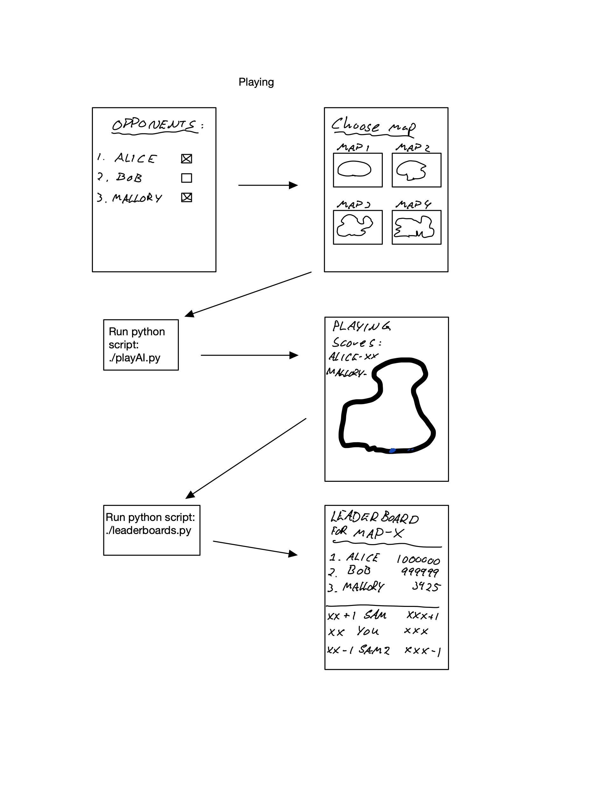

# Compete with your NEAT AI racing driver

---

## General

This is a demonstration and game of NEAT where each registered player is responsible for training an AI racing driver, which they can use to compete with other players.

## Setup

This code has mainly been tested using the newest version of python (3.10.5).
Ensure you have the required python libraries by installing from [requirements.txt](./requirements.txt).

```bash
pip install -r requirements.txt
```

#### Additional recommended setup step (optional)

Using a `python-venv`:
On Unix distributions ensure `python-venv` is installed, can be installed with `apt install python3.x-venv` (replace `x` with wanted python version). Activate a `python venv` with:

```bash
python3 -m venv <venv-name>
```

Then go ahead and do the [setup](#setup)

## Usage

This code has three scripts that are meant to be run from a unix shell to train, play and display the leaderboard.

In general there are two steps for being able to compete with other users AI´s:

1. **[Training](#training)**: The user needs to train a model they can use to play against other users.
2. **[Playing](#playing)**: The user needs to pick their opponents, as of now there is no limit to how many players one can play against, there is only a limit on how many other players have pre-trained models.
3. **[Leaderboard](#leaderboard)** (Additionally) Display a global leaderboard on a per-map basis. 

### Training
To use the script a database entry of the player´s model is first needed. A script to do just this is [`trainAI.py`](./trainAI.py):

```bash
usage: ./trainAI.py [-h]
                    trainer
                    {alpine,redbull,astonmartin,mercedes,alphatauri,mclaren,blue,alpharomeo,ferrari,green,williams,haas,magenta,red}
                    {1,2,3,4,5} [generations] [weight_mutate_power] [weight_mutate_rate] [weight_replace_rate]

Train a neural network to drive a racing car.

positional arguments:
  trainer               Select your trainer name
  {alpine,redbull,astonmartin,mercedes,alphatauri,mclaren,blue,alpharomeo,ferrari,green,williams,haas,magenta,red}
                        Select your car color
  {1,2,3,4,5}           Select which map by integer (1 - 5) to train on.
  generations           Number of generations model will train to.
  weight_mutate_power   Set the weight_mutate_power parameter in neat config. Value must be 0.0 < x < 1.0.
  weight_mutate_rate    Set the weight_mutate_rate parameter in neat config. Value must be 0.0 < x < 1.0.
  weight_replace_rate   Set the weight_replace_rate parameter in neat config. Value must be 0.0 < x < 1.0.

options:
  -h, --help            show this help message and exit
```

**More specifically** the command is thought to be used as:
```bash
./trainAI.py <name : str> <color : str> <map : int> <generations : int> <mutation power : float> <mutation rate : float> <replace rate : float> 
```

#### Example training command

```bash
./trainAI.py Alice astonmartin 3 15 0.2 0.5 0.3
```

This will start a `pygame` window with the different (non-interactive) models trying to learn the game map.

When `generations` criteria has been met, the script stores the model to the `user`´s directory in the [database](./db_handler.py).

### Playing

Once you have a trained model and there is at least one more player registered in the database you are ready to play. Use `./playAI.py` to start playing.

```bash
usage: ./playAI.py [-h] player {1,2,3,4,5} opponent [opponent ...]

Play with your trained neural network.

positional arguments:
  player       The name of the player, must exist a database record of this player.
  {1,2,3,4,5}  The number of the map to play on.
  opponent     Opponents to play against.

options:
  -h, --help   show this help message and exit
```

**More specifically**
```bash
./playAI.py <player1 : str> <map : int> <other players : str | list of str>
```

#### Example usage

```bash
./playAI.py Alice 3 Bob Mallory
```

This will launch a game on [map number 3](./assets/maps/map3.png) with three players - Alice, Bob and Mallory. When the game is over each of their scores are saved to [leaderboard for map number 3](./assets/leaderboards/leaderboard-map3.csv).

### Leaderboard

There is an additional callable cli script [leaderboard.py](./leaderboard.py) with usage:

```bash
usage: leaderboard.py [-h] [-t] {1,2,3,4,5}

See the leaderboard

positional arguments:
  {1,2,3,4,5}  The map to show the leaderboard for.

options:
  -h, --help   show this help message and exit
  -t, --test   Test the leaderboard.
```

The `-t`option injects some artificial users with scores to the specified leaderboard.

### Database structure

A simple implementation of a database is made for this project. Users get their own directory within the database directory, in each of the users entries three files are stored: `config.txt`, `model.pkl` and `texture.txt` which respectively represent what config to use in training, what model to use in playing and the texture the user specified which will be used in every display-aspect of the game.

Graphical illustration of the database structure:

```bash
database
├── Alice
│   ├── config.txt
│   ├── model.pkl
│   └── texture.txt
├── Bob
│   ├── config.txt
│   ├── model.pkl
│   └── texture.txt
└── Mallory
    ├── config.txt
    ├── model.pkl
    └── texture.txt
```

### Assets

The default resources used in the implementation is stored in `./assets`, with the exeption of the database. Here we find all car-textures, maps the default configuration, and the leaderboards.

```bash
assets
├── car-textures
│   ├── alpharomeo.png
│   ├── alphatauri.png
│   ├── alpine.png
│   ├── astonmartin.png
│   ├── blue.png
│   ├── ferrari.png
│   ├── green.png
│   ├── haas.png
│   ├── magenta.png
│   ├── mclaren.png
│   ├── mercedes.png
│   ├── red.png
│   ├── redbull.png
│   └── williams.png
├── defaultconfig.txt
├── leaderboards
└── maps
    ├── map1.png
    ├── map2.png
    ├── map3.png
    ├── map4.png
    └── map5.png

3 directories, 20 files
```

## How to contribute

In general what is sorely missing from this implementation is a nice graphical UI which is highly accessible for children playing the game on a touch screen. The code and execution of commands and scripts have been tailored to be bound to buttons in a final GUI implementation, which is yet to be constructed.





### Creating new maps

Maps are easy to create! Simply make a png file where the starting line is in the same position as all other maps and draw a thick line from start to finish, the AI will stay inside the black line representing a road, and collide with white pixels.
Once the map is finished, place it into `assets/maps`

### Known bugs / Issues

1. Per player name there is only the option to store one model at a time. This means that if two users have the same username, the most recent registry will override the oldest model. This was a choice made due to when training some models it is not certain the AI will be able to drive any meaningful distance before the `generations` criteria is met, so all it takes to train the same user again is to use the same name when training and this will override the previous model. The thought of limiting each user to one training attempt therefore was not a viable option, and authenticating each user is uneccesarily much work. This is not necessarily too important but it has some side effects which I will come to now.

2. A reprecussion of the issue mentioned above is that the leaderboard as per now only accepts one entry score from each user, duplicates of names with a lower score will always be discarded. To remove just this feature is simple enough, remove pandas function [drop_duplicates](https://github.com/SFI-Visual-Intelligence/AI-exhibition/blob/main/ai-car-simulation/leaderboard.py?plain=1#L50).

3. **Be aware**: When initially cloning the repository from github an error might arise where the leaderboard folder is not present, therefore if an `OSError` is encountered, please create the folder: `./assets/leaderboards`.


## Hardware requirements
<p>The program was put together an run on a laptop.<br>
The program can be run on a computer with the minimum spesifications:<br>
Processor: Intel Core i3-5005U CPU<br>
Ram: 8.00GB<br>
Platform: Windows x64<br>
Graphic card: None<br>
Disc space: 800 MB<p>
