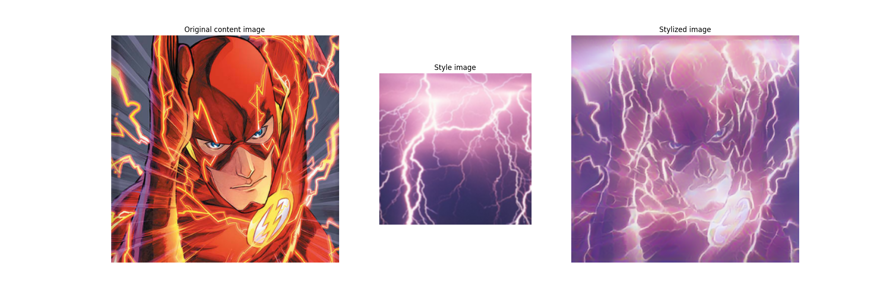

# Art-drawing
## Artstyle merging


---
## What is this?

This program uses premade machine learning algorithm to merge an image with a style from an other image.

## Setup

There are a few libraries needed to run the program, we recommend using a `python venv` with the command `python -m venv venv`. Installing requirements using the following command in the directory:

```bash
$ pip install -r requirements.txt
```

## Usage

1. **Loading image.**
    The program will need a picture of the user. When running the program it will first display a camera where you will press space to capture an image. The program can be run in the command line by using the command:
    ```bash
    $ python artmerging.py
    ```

    **Try and make sure that the background does not have to much variation of shapes and colors.**
    After capturing an image the user will be prompted about which style they want the image to be in. The user is prompted with options 1 to 9, which are each different styles, the user will input the number of the style they want. More styles can be added.
    Both the taken image and the chosen style will be displayed. Close the window and wait until the new image is created. When the image is finished it will be displayed along with the original taken image and the style chosen. All images generated from capturing and during the algorithm will be deleted when the program is finished. Note that the program does not focus on people or their faces, it takes the image as a whole han applies the new style.
**Here is an example of the flash from DC comic stylized in purple lightning**

Original image with style image and stylized image:


## How it works - Short description
The algorithm uses deeplearning the generate one image in the style of another. This is called *neural style transfer*. The achitecture of the neural network follows VGG19. The first few layers in the network represent low-level features like egdes and textures, while the final few layers represent higher-level features like object parts. The intermidiate layers define the style.

## NB
Maybe remove the lightning image since rights to the image has not been checked.<br>


**Hardware requirements**
<p>The program was put together an run on a laptop.<br>
The program can be run on a computer with the minimum spesifications:<br>
Processor: Intel Core i3-5005U CPU<br>
Ram: 8.00GB<br>
Platform: Windows x64<br>
Graphic card: None<br>
Disc space: 800 MB<p>


Original code:
https://github.com/tensorflow/docs/blob/master/site/en/tutorials/generative/style_transfer.ipynb
