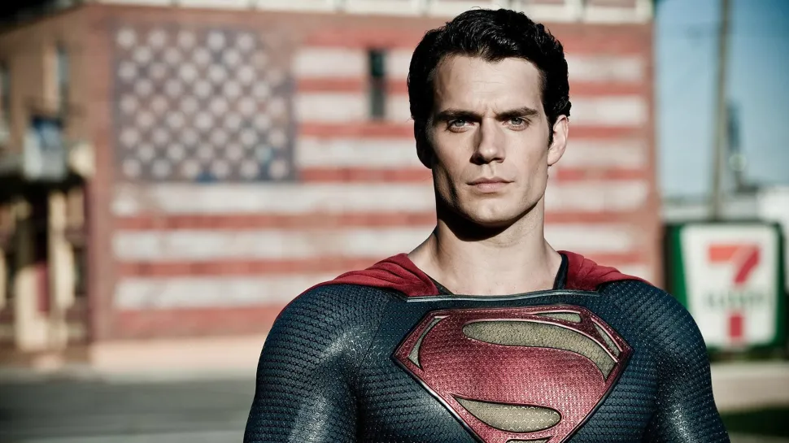
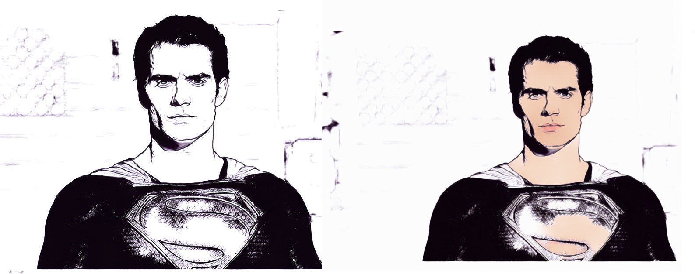

# Art-drawing


---
## What is this?

This program uses premade machine learning algorithm to generate an image of a person in a comic style. Both with and without color is available.

## Setup

There are a few libraries needed to run the program, we recommend using a `python venv` with the command `python -m venv venv`. Installing requirements using the following command in the directory:

```bash
$ pip install -r requirements.txt
```

## Usage

1. **Loading image.**
    The program will need a picture of the user. When running the program it will first display a camera where you will press space to capture an image. The program can be run in the command line by using the command:
    ```bash
    $ python app.py
    ```

    **Try and make sure that the background does not have to much variation in color or strong lighting.**
    After capturing an image the user will be prompted about wanting colored or non-colored image. The user will input either 'color' or 'grey' depending on what they want.
    Generating the image will take a few seconds. When the image is finished it will be displayed, where the user can press 's' to save the image or 'esc' to exit. All images generated from capturing and during the algorithm will be deleted, with an exception of the image saved by pressing 's' on the last display.

**Here is an example of superman from the Superman man of steel movie**

Original image:


Comic style images:



**Hardware requirements**
<p>The program was put together an run on a laptop.<br>
The program can be run on a computer with the minimum spesifications:<br>
Processor: Intel Core i3-5005U CPU<br>
Ram: 8.00GB<br>
Platform: Windows x64<br>
Graphic card: None<br>
Disc space: 800 MB<p>
