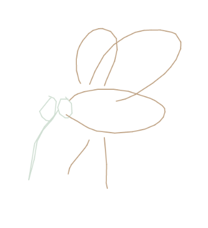
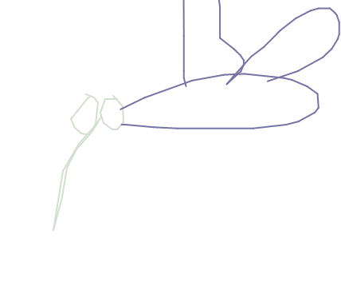
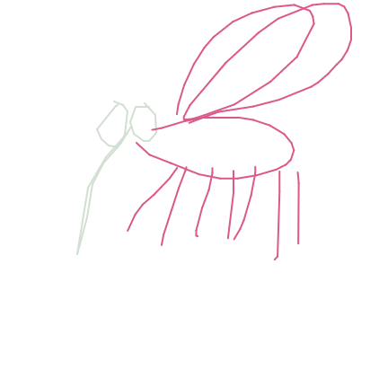

# Sketch RNN
### using magenta and a neural network to finish drawings

---
## What is this?
This program uses a neural network to be able to finish drawing that a person has drawn. The user selects something to draw from a list and then they can start drawing the selected animal or object. The program will then try and complete the drawing from what the user has drawn.

#Setup
The program is run with javascript and has to be run in the a browser. This can be done in the command line. Direct the commandline to the *sketch-rnn-js* folder and use the command:
```bash
$ python3 -m http.server
```

##Usage

1. **Drawing and choosing what to draw**

    When the program is open it displays what category is currently chosen. The category can be changed by clicking the categories on the bottom left of the display. A list will appear and there will take a few moments to load the new model.
    The user can draw by holding the mouse button whilst moving the cursor on the canvas. The program will finish the drawing then remove its contribution and redraw, however it is slightly different. This can be observed in the images below, the three drawing were done in a row.

**Here is an example of a drawing of a mosquito**

The light green part of the mosquito was drawn by the user:


   


## Hardware requirements
<p>The program was put together an run on a laptop.<br>
The program can be run on a computer with the minimum spesifications:<br>
Processor: Intel i7-7700HQ CPU<br>
Ram: 8.00GB<br>
Platform: Ubuntu 20.04.4 LTS x86_64<br>
Graphic card: NVIDIA GeForce GTX 1070 mobile<br>
Disc space: 25 MB<p>