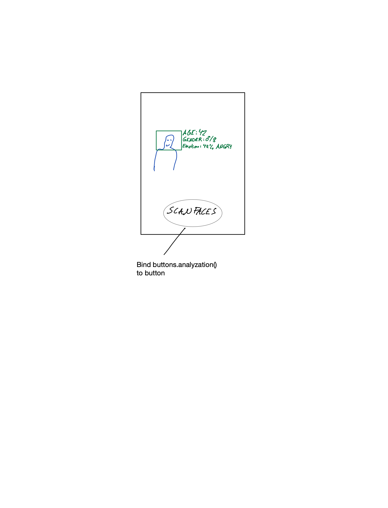

# Computer Vision 
### using opencv´s haarcascade face recognizer in conjunction with deepface´s analyzing features.

---
## What is this?

This program uses two different premade machine learning algorithms to first detect a face and display the name of the person, then another algorithm will analyze each face it sees and display a predicted *age*, *gender* and *emotion* to this face.

## Setup

There are a few libraries needed to run the program, we recommend using a `python venv` with the command `python -m venv VENVNAME`. Installing requirements using the following command in the directory:

```bash
$ pip install -r requirements.txt
```

## Usage

1. **Using the program**
    To run the program run the command below
    
    ```bash
    $ python face_detector.py
    ```

    A videofeed will be displayed and the model will try to frame all the faces in the video feed. When the user(s) press the spacebar the *deepface.analyse* algorithm will run. Note that the first analyzation will make the video feed freeze for a few moments. The estimated age, gender and dominant emotion will be displayed on each face the algorithm found and it will update every time the user(s) press spacebar.

**GUI vision**
<p>We envision an interface where there is a start button and when it is pressed the program starts running and then a button appears for the face analyzation. After a while of not being interacted with, the program goes back to the start screen, and wipes the face estimations.<p>

#### GUI-idea



## Known issues

1. **Faces with wrong information**
    <p> When the estimation of attributes are run on one or multiple faces the position of the faces the estiamtions has been done on are updated so that the estimations are displayed on the correct faces. However if the faces disappear (people leaving the frame) the information is not removed, which means that when new faces appear the previous estimations will be displayed on them until they rerun the estimation algorithm. <p>

**Hardware requirements**
<p>The program was put together an run on a laptop.<br>
The program can be run on a computer with the minimum spesifications:<br>
Processor: Intel Core i3-5005U CPU<br>
Ram: 8.00GB<br>
Platform: Windows x64<br>
Graphic card: None<br>
Disc space: 800 MB<p>

Christian Salomonsen and Tobias Antonsen has put together this demo
