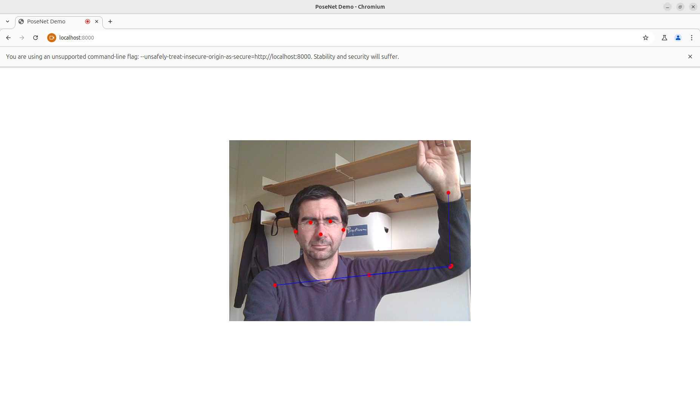

# Posenet demo

Detect keypoints on the body from the webcam and display them in real time.
This is coded in javascript.

## how to run it

* Go to the folder of the demo, and run a local server using: `python -m http.server`
* open your browser and enter the url `localhost:8000` (you may need to grant access to localhost to your browser)

### Access to Webcam
The Browser needs to access the webcam, you need to change the settings for this. 
For Chrome, you need to follow these steps.
1. Navigate to `chrome://flags/#unsafely-treat-insecure-origin-as-secure` in Chrome.
2. Find and enable the `Insecure origins treated as secure` section.
3. Add any addresses you want to ignore the secure origin policy for. Remember to include the port number too (if required). Here: `localhost:8000`

