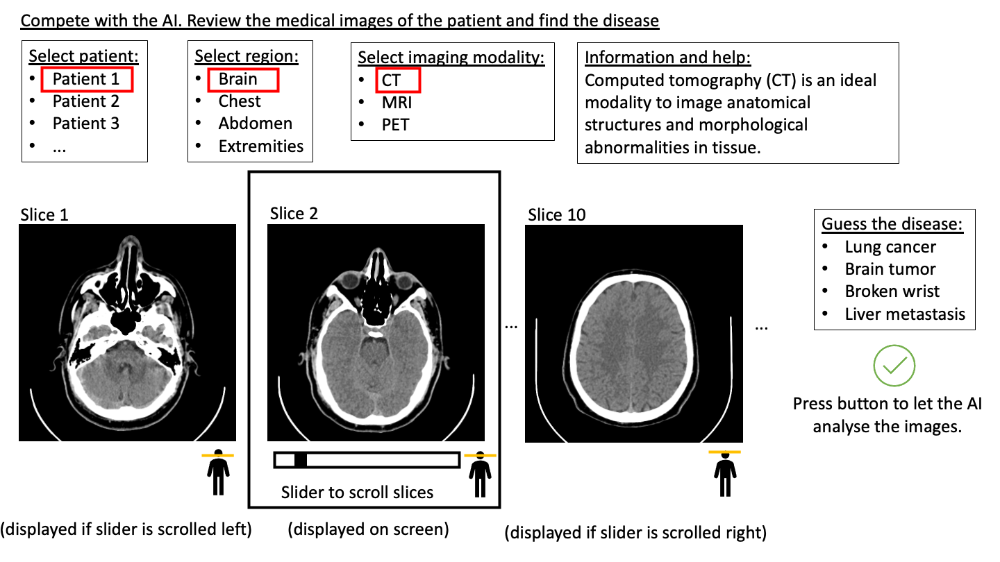
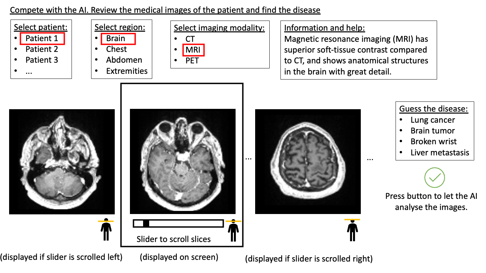
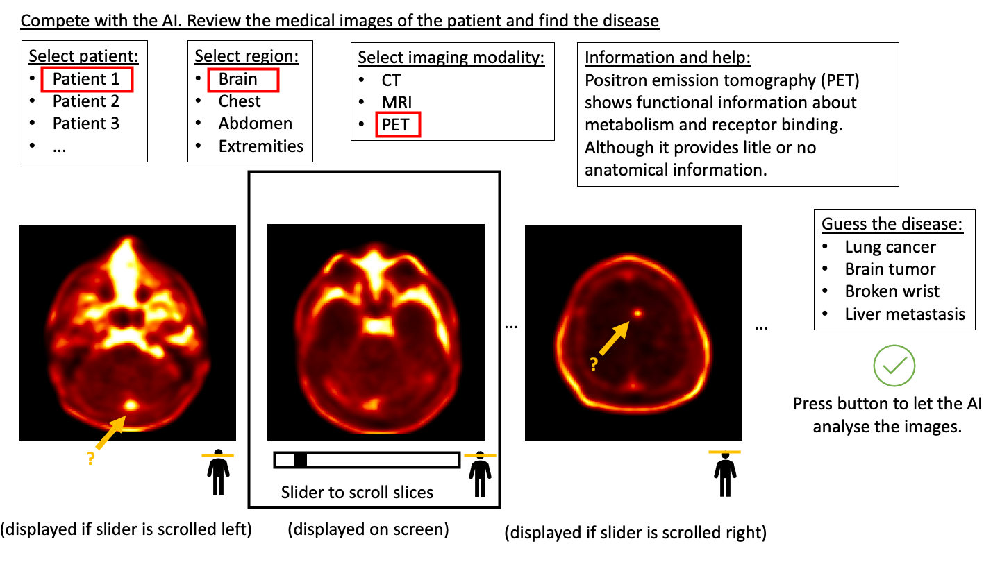
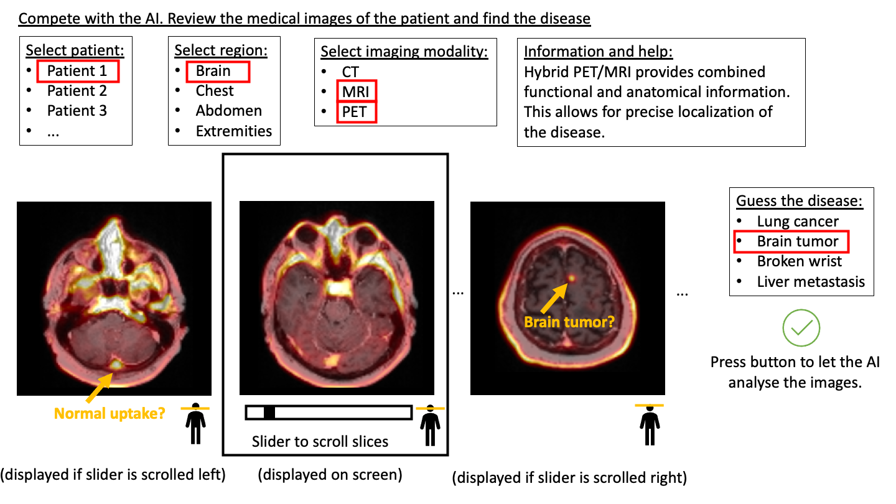
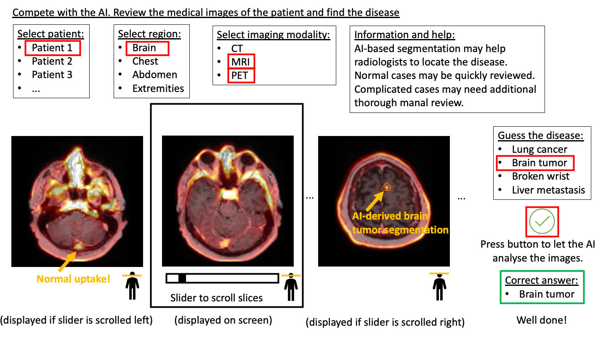

# Medical Image Segmentation Demo

In this AI-exhibition demo, the task is to review a series of medical images and find the disease. The images and segmentations shown will not be calculated in real-time, rather be pre-calculated and just displayed to the user.

1. First, user has to select a patient, region and imaging modality:

Only the central square (current slice) will be shown on the display. The active slice can be changed with a slider. Some information is shown in a box about the current imaging modality.

2. The user reviews the slices for abnormal findings. By changing modality, the user may get additional information about the current patient, for instance by selecting the MRI modality:

3. The user selects the PET modality and finds two suspicious high-uptake regions (arrows), but still it is not clear which of these are the disease:

4. When the user selects to view two modalities simultaneously (PET+MRI), the pathological and healthy uptake may be successfully differentiated. The user selects the disease in the list of possible diseases. 

5. The user can finally ask the AI for help to solv the task.  By pressing the green check button, the results from a hypothetical AI prediction will be displayed. 

